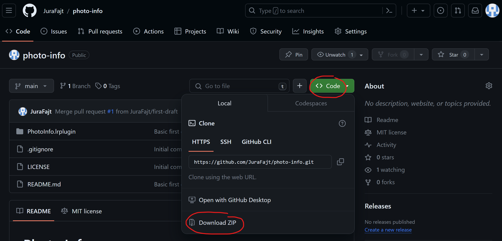
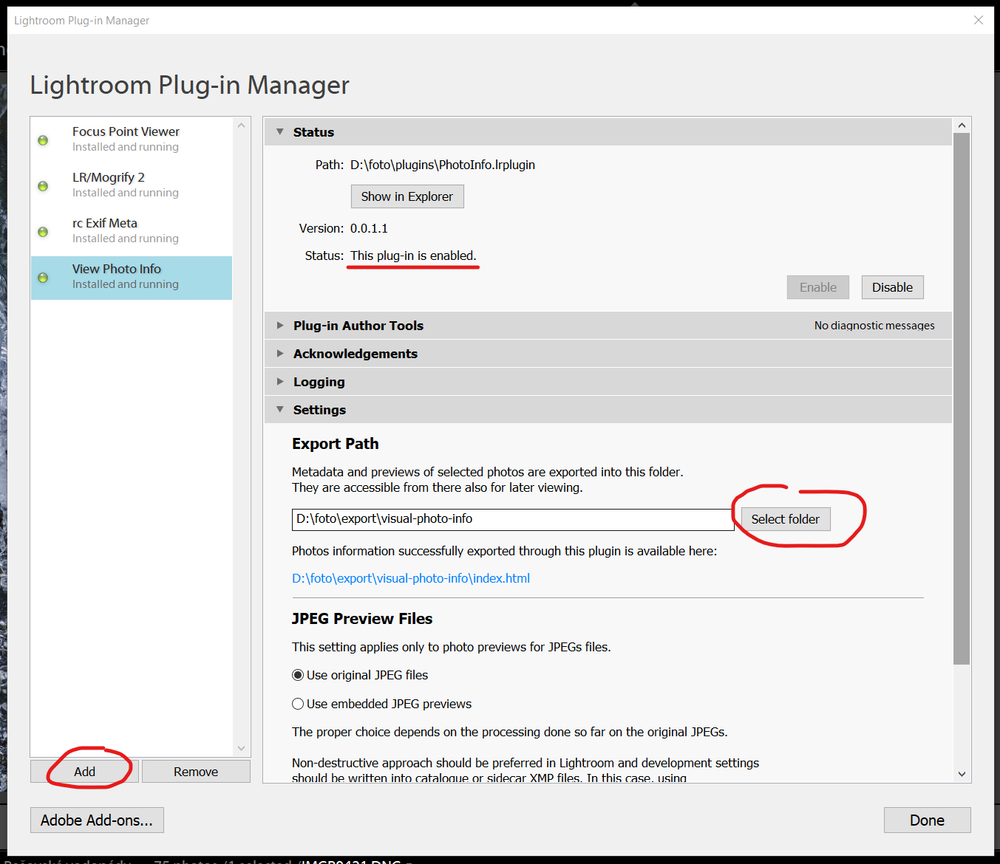
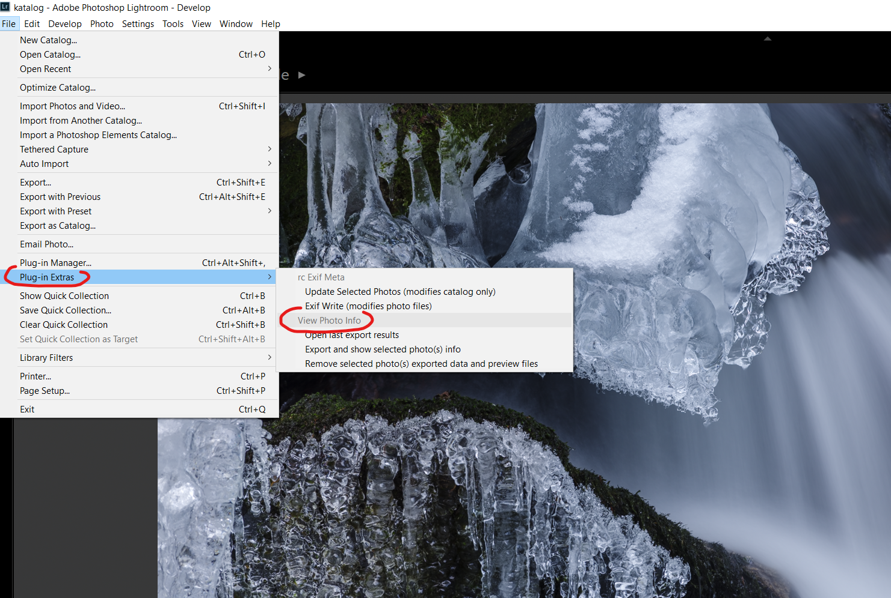
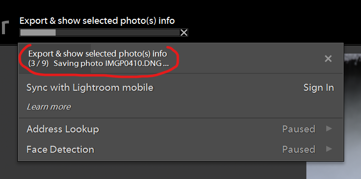
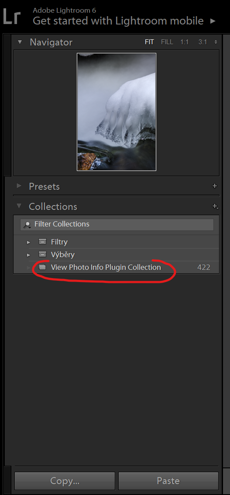
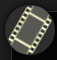
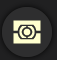
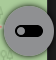
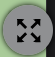
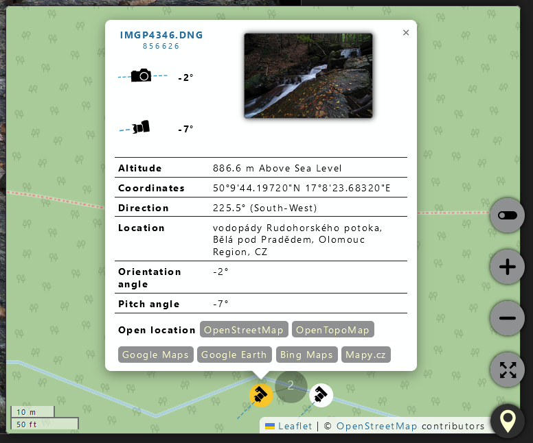

# Photo Info

Adobe Lightroom plugin for exporting and displaying detailed photo information in a form of local HTML page.


## Motivation behind this plugin

- Visualization of additional photo data which is not easily being displayed in Lightroom.
- Overcome the discrepancies between MacOS and Windows regarding rendering layered graphics in LR.
- Overcome the problem with guessing correct LR dialog size on Windows.
- Additional interactivity compared to some existing plugins.
- More accurate visualization of focus areas and metering segments.
- Covering various crop modes for a given camera.
- Storing the exported info for later browsing (incremental exports).
- Sharing configuration data for various camera models if possible.


## How does it work

Instead of error-prone generation of visual photo information using directly Lightroom UI and LUA dialogs,
this plugin exports a set of scripts, styling, extracted image data and metadata to selected folder
to compose a content of locally accessible HTML page. The exported HTML page will be automatically
shown in default system web browser after each export batch is finished.

The exported data is permanent, so viewable later even when Lightroom is closed. The export is incremental,
original exported files are not being deleted and only if same files are selected on next export,
the exported data for them will be rewritten.

This is a tool for mostly analytical purposes. Thus it works with original preview image data (if available)
and metadata. The corrections / image modifications done in Lightroom are not being considered. That means
that LR crop, rotation, upright corrections etc. will be ignored and the plugin displays the image mostly
in the state when it was taken. This makes it much easier to display focus areas and metering segments
in correct places.

For cameras with more than 1 crop factor option, the cropped area is also being shown as a dark frame.
Examples: For a "full frame" camera photo taken with 1.5x APSC crop, the dark frame will be displayed.
For a "full frame" camera photo taken with 1x factor (no crop), no dark frame is displayed.
For an APSC camera with the possibility of only 1.5x crop factor, no dark frame is displayed.


## Covered camera models

| Model               | Year | Crop Sizes      | Phase Detection AF | AF areas  | Metering Segments |
|---------------------|------|-----------------|--------------------|----------:|------------------:|
| Pentax &ast;ist D   | 2003 | 3008×2008, 1.5× | Safox 9+ or lower  | 11        | 16                |
| Pentax &ast;ist DS  | 2004 | 3008×2008, 1.5× | Safox 9+ or lower  | 11        | 16                |
| Pentax &ast;ist DS2 | 2005 | 3008×2008, 1.5× | Safox 9+ or lower  | 11        | 16                |
| Pentax &ast;ist DL  | 2005 | 3008×2008, 1.5× | Safox 8            | 3         | 16                |
| Pentax &ast;ist DL2 | 2006 | 3008×2008, 1.5× | Safox 8            | 5         | 16                |
| Pentax K100D        | 2006 | 3008×2008, 1.5× | Safox 9+ or lower  | 11        | 16                |
| Pentax K110D        | 2006 | 3008×2008, 1.5× | Safox 9+ or lower  | 11        | 16                |
| Pentax K10D         | 2006 | 3872×2592, 1.5× | Safox 9+ or lower  | 11        | 16                |
| Pentax K100D Super  | 2007 | 3008×2008, 1.5× | Safox 9+ or lower  | 11        | 16                |
| Pentax K-m          | 2008 | 3872×2592, 1.5× | Safox 8            | 5         | 16                |
| Pentax K200D        | 2008 | 3872×2592, 1.5× | Safox 9+ or lower  | 11        | 16                |
| Pentax K20D         | 2008 | 4672×3104, 1.5× | Safox 9+ or lower  | 11        | 16                |
| Pentax K-x          | 2009 | 4288×2848, 1.5× | Safox 9+ or lower  | 11        | 16                |
| Pentax K-7          | 2009 | 4672×3104, 1.5× | Safox 9+ or lower  | 11        | 16                |
| Pentax K-r          | 2010 | 4288×2848, 1.5× | Safox 9+ or lower  | 11        | 16                |
| Pentax K-5          | 2010 | 4928×3264, 1.5× | Safox 9+ or lower  | 11        | 77                |
| Pentax K-30         | 2012 | 4928×3264, 1.5× | Safox 9+ or lower  | 11        | 77                |
| Pentax K-5 II       | 2012 | 4928×3264, 1.5× | Safox 10           | 11        | 77                |
| Pentax K-5 IIs      | 2012 | 4928×3264, 1.5× | Safox 10           | 11        | 77                |
| Pentax K-01         | 2012 | 4928x3264, 1.5× | contrast 81 areas? | ?         | ?                 |
| Pentax K-50         | 2013 | 4928×3264, 1.5× | Safox 9+ or lower  | 11        | 77                |
| Pentax K-500        | 2013 | 4928×3264, 1.5× | Safox 9+ or lower  | 11        | 77                |
| Pentax K-3          | 2013 | 6016×4000, 1.5× | Safox 11           | 27        | 1350              |
| Pentax K-S1         | 2014 | 5472×3648, 1.5× | Safox 9+ or lower  | 11        | 77                |
| Pentax K-S2         | 2015 | 5472×3648, 1.5× | Safox 10           | 11        | 77                |
| Pentax K-3 II       | 2015 | 6016×4000, 1.5× | Safox 11           | 27        | 1350              |
| Pentax K-70         | 2016 | 6000×4000, 1.5× | Safox 10           | 11        | 77                |
| Pentax K-1          | 2016 | 7360×4912, 1×<br>4800×3200, 1.5× | Safox 12 | 33 | 1350              |
| Pentax KP           | 2017 | 6016×4000, 1.5× | Safox 11           | 27        | 1350              |
| Pentax K-1 Mark II  | 2018 | 7360×4912, 1×<br>4800×3200, 1.5× | Safox 12 | 33 | 1350              |


## Installation

### Downloading the `PhotoInfo.lrplugin`

- In the [GitHub repository page](https://github.com/JuraFajt/photo-info), click the `Code` button, then the `Download ZIP` button.
    

- That should download the `photo-info-main.zip` file. It contains the `photo-info-main` folder with the `PhotoInfo.lrplugin` folder inside.

- Copy the `PhotoInfo.lrplugin` folder to a preferred place in your local filesystem.

### Lightroom Plugin Manager Setup

- Open the Plugin Manager from application menu `File` -> `Plug-in Manager...`
    

- Click the `Add` button at the bottom, browse to the filesystem path where the `PhotoInfo.lrplugin` folder was stored and click `Select Folder`.

- Now the `View Photo Info` plugin information should be visible in the Plugin Manager, enabled & running.

- Last mandatory thing to set up before using the plugin is the `Export Path` in the `Settings` section. It should point to a folder where the exported data will be stored. It is important to `select a different folder than the plugin folder itself!`

- Close the Plugin Manager by clicking the `Done` button.


## Running the plugin

- The plugin actions are accessible from application menu `File` -> `Plug-in Extras` -> `View Photo Info` commands section.
    

    - `Open last export results` just opens the last exported `index.html` file (if it exists).

    - `Export and show selected photo(s) info` starts eporting previews and data for selected photos.

    - `Remove selected photo(s) exported data and preview files` starts cleanup of exported data for selected photos.

- When running the export, progress bar is displayed at the top of the main window. Clicking the progress bar displays detailed progress info.
    

- After a successfull export, the exported photo(s) are also added to the dedicated `View Photo Info Plugin Collection`. This can be useful for example for removing some (or all) of the exported photo(s) previews and data files.
    

## Displaying exported data

- After successful export, the data will be displayed in a local HTML page (`index.html` file in the export path). This file should get automatically open in default system browser.
    

- Main panels and some other UI features can be toggled with the icons in page corners.

### Filmstrip panel

- Can be toggled with  button in the top left page corner.

- Displays the list of exported photos.

- Hovering a particular image in the strip displays tooltip with some basic ifnormation about the photo.

- Clicking the photo thumbnail will select it for displaying in the main area.

### Main photo area

- Displays the currently selected photo in scaled or actual 1:1 size mode. Switching the mode is done with  button.

- In the actual size mode, image overlays are disabled and the image panning is possible.

- In the scaled size mode, image overlays for `focus areas` and `metering segments` can be displayed. Hovering the particular UI element will display a tooltip with more information.

- `Focus areas` are displayed with  button.

- `Metering segments` are displayed with  button.

- Both focus areas & metering segments overlays can be toggled between normal, hightlighted and no display states.

### Metadata panel

- Can be toggled with  button in the top right corner.

- Displays exported metadata for the selected photo, optionally filtered by currently selected filter.

- Metadata can be exported to a file.

- Particular cell content in the metadata table can be copied to clipboard by clicking the cell with the mouse.

### Map panel

- Can be toggled with  button in the bottom right corner.

- Displays selected photo location with location-related data in a map.

- The  button toggles between OpenStreetMap and OpenTopoMap tile variants.

- The  button toggles between small and expanded map view.

- Photos are represented by small camera icons. Those can be directional & properly oriented in the map if needed data is available. 

- If there are multiple photos close to one location, the corresponding icons might be grouped into clusters. Clicking the cluster will expand it into a "spider" and the particular photo icons can then be selected.

- Selecting the photo icon in map will display a tooltip with additional location and orientation data.
    

- Clicking the thumbnail in the tooltip will select the particular photo for displaying detailed info in the main area.

- Clicking a particular data cell in the tooltip table will copy its content into clipboard.

- Clicking one of the links at the bottom of the tooltip will open the location in the corresponding map provider.

## TODO

- open generated HTML page in the same browser tab

tried fiddling like this in test.html file with no success:
```html
 <html>
  <head>
    <title>Redirecting ...</title>
    <!-- meta http-equiv="refresh" content="0;URL='index.html';TARGET='PhotoInfo'" / -->
  </head>
  <body>
    <p>Please wait wihle redirecting to <a id="link" href="index.html" target="_Photo_Info">main page</a>...</p>
    <script>
      const link = document.getElementById('link');
      link.click(); // opens always in a new window, ignoring the target attribute of the link
      setTimout(() => window.close(), 500); // doesn't close when not opened via window.open()
    </script>
  </body>
</html>
```

also tried
```lua
local openUrlInBrowser = import 'LrHttp'.openUrlInBrowser
...
-- supposed target parameter not working, was just a guess
-- even if it worked for "normal" links, probably doesn't work for the file protocol
openUrlInBrowser(indexFile, '_test')
```

- Application features
  - CUZK orthophoto map - usage conditions?
    - tile URL looks like this, max zoom seems to be 18, seems to be loaded via ESRI JS viewer, 
      https://ags.cuzk.cz/arcgis1/rest/services/ORTOFOTO_WM/MapServer/WMTS/tile/1.0.0/ORTOFOTO_WM/default/default028mm/17/44666/71826
      https://ags.cuzk.cz/arcgis1/rest/services/ORTOFOTO_WM/MapServer/WMTS/tile/1.0.0/ORTOFOTO_WM/default/default028mm/{z}/{x}/{y}
    - probably can be loaded via https://www.npmjs.com/package/esri-leaflet this way
      <script src="https://unpkg.com/esri-leaflet@3.0.10/dist/esri-leaflet.js"></script>
      L.esri.tiledMapLayer({
        url: 'https://ags.cuzk.cz/arcgis1/rest/services/ORTOFOTO_WM/MapServer'
      }).addTo(map);
  - Contrast AF detection for Pentax.
    - sensor 36.4 MP Sony IMX094 Exmor
  - Switching between phase & contrast detection AF visualization automatically
  - Metering info for live view now showing 0 LV values.
  - Metering iso-zones visualization with adjustable colors scale.
  - Phase, contrast AF, metering segments for other brands (ongoing for later).

  - Command line tool exporting the same functionality directly from photo files w/o Lightroom?
  - Win App doing the same visually? Or a PWA?

- Application UI
  - Have FOV info presented somewhere visually.
  - Maybe let the SVGs for heading angle, orientation angle, pitch angle overlap in the whitespace part, thus placing them on 1 row doesn't take up so much space? Labels for the values can be below them. FOV part of same icons, maybe even adjustable visually to correct angle?

- Documentation
  - describe installation, especially exiftool
  - describe filmstrip / exported photos selection
  - describe toggling on/off of metering segments UI
  - describe toggling on/off of focus areas UI
  - desribe toggling 100% zoom
  - describe metadata filters
  - More remarks about the Pentax metering segments variants, that they actually scaled/reused mostly same shapes
  configuration for several models.
  - Mention resources/authors found on web and also the other plugins which inspired this.
