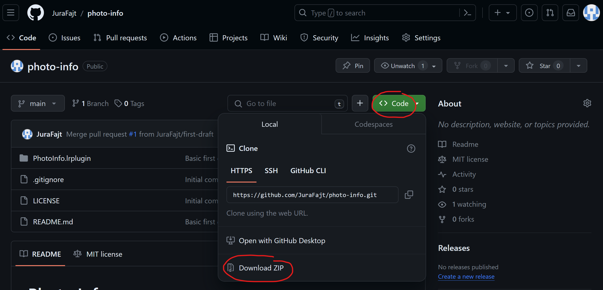
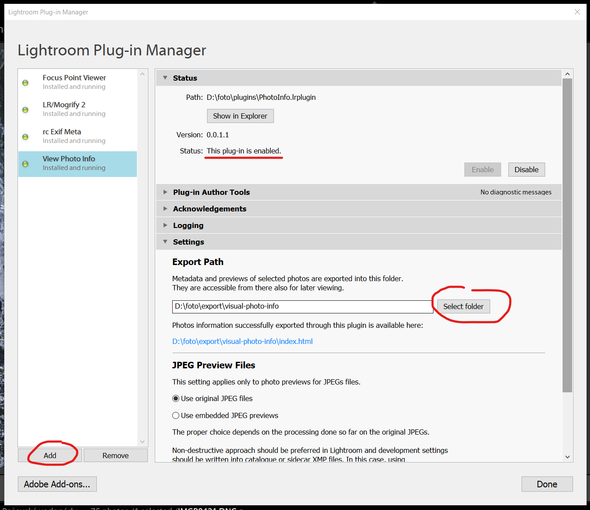
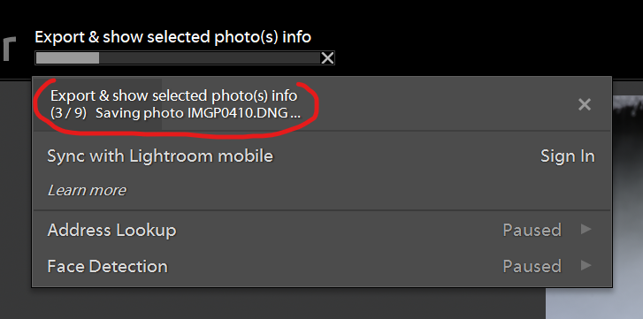
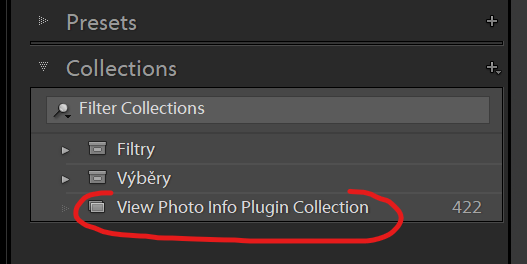

# Photo Info

Adobe Lightroom plugin for exporting and displaying detailed photo information in a form of local HTML page.

## Motivation behind this plugin

- Visualization of additional photo data which is not easily being displayed in Lightroom.
- Overcome the discrepancies between MacOS and Windows regarding rendering layered graphics in LR.
- Overcome the problem with guessing correct LR dialog size on Windows.
- Additional interactivity compared to some existing plugins.
- More accurate visualization of focus areas and metering segments.
- Covering various crop modes for a given camera.
- Storing the exported info for later browsing (incremental exports).
- Sharing configuration data for various camera models if possible.

## How does it work

Instead of error-prone generation of visual photo information using directly Lightroom UI and LUA dialogs,
this plugin exports a set of scripts, styling, extracted image data and metadata to selected folder
to compose a content of locally accessible HTML page. The exported HTML page will be automatically
shown in default system web browser after each export batch is finished.

The exported data is permanent, so viewable later even when Lightroom is closed. The export is incremental,
original exported files are not being deleted and only if same files are selected on next export,
the exported data for them will be rewritten.

This is a tool for mostly analytical purposes. Thus it works with original preview image data (if available)
and metadata. The corrections / image modifications done in Lightroom are not being considered. That means
that LR crop, rotation, upright corrections etc. will be ignored and the plugin displays the image mostly
in the state when it was taken. This makes it much easier to display focus areas and metering segments
in correct places.

For cameras with more than 1 crop factor option, the cropped area is also being shown as a dark frame.
Examples: For a "full frame" camera photo taken with 1.5x APSC crop, the dark frame will be displayed.
For a "full frame" camera photo taken with 1x factor (no crop), no dark frame is displayed.
For an APSC camera with the possibility of only 1.5x crop factor, no dark frame is displayed.

## Installation

### Downloading the `PhotoInfo.lrplugin`

- In the [GitHub repository page](https://github.com/JuraFajt/photo-info), click the `Code` button, then the `Download ZIP` button.
    

- That should download the `photo-info-main.zip` file. It contains the `photo-info-main` folder with the `PhotoInfo.lrplugin` folder inside.

- Copy the `PhotoInfo.lrplugin` folder to a preferred place in your local filesystem.

### Lightroom Plugin Manager Setup

- Open the Plugin Manager from application menu `File` -> `Plug-in Manager...`
    

- Click the `Add` button at the bottom, browse to the filesystem path where the `PhotoInfo.lrplugin` folder was stored and click `Select Folder`.

- Now the `View Photo Info` plugin information should be visible in the Plugin Manager, enabled & running.

- Last mandatory thing to set up before using the plugin is the `Export Path` in the `Settings` section. It should point to a folder where the exported data will be stored. It is important to `select a different folder than the plugin folder itself!`

- Close the Plugin Manager by clicking the `Done` button.

## Running the plugin

- The plugin actions are accessible from application menu `File` -> `Plug-in Extras` -> `View Photo Info` commands section.
    

    - `Open last export results` just opens the last exported `index.html` file (if it exists).

    - `Export and show selected photo(s) info` starts eporting previews and data for selected photos.

    - `Remove selected photo(s) exported data and preview files` starts cleanup of exported data for selected photos.

- When running the export, progress bar is displayed at the top of the main window. Clicking the progress bar displays detailed progress info.
    

- After a successfull export, the exported photo(s) are also added to the dedicated `View Photo Info Plugin Collection`. This can be useful for example for removing some (or all) of the exported photo(s) previews and data files.
    

## Displaying exported data

- After successful export, the data will be displayed in a local HTML page (`index.html` file in the export path). This file should get automatically open in default system browser.
    

- Main panels and some other UI features can be toggled with the icons in page corners.

- State of the main toggles is remembered via browser's `localStorage`. After reloading, the page should (mostly) restore the last state.

[Displaying exported data - detailed description](docs/exported-ui.md)

## [Supported camera models](docs/supported-cameras.md)

## [TODOs, Improvement Suggestions](docs/todo.md)

