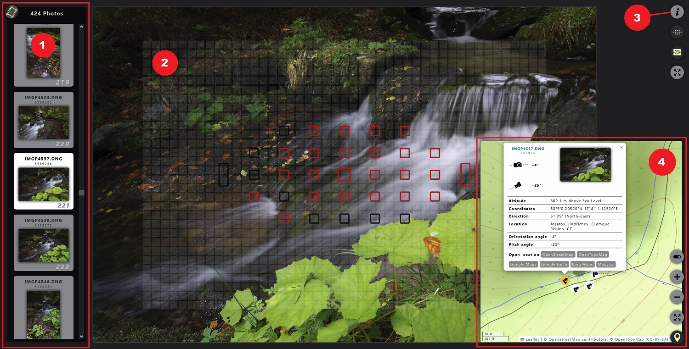

# Photo Info

Adobe Lightroom plugin for exporting and displaying detailed photo information in a form of local HTML page.

- [Motivation behind this plugin](docs/motivation.md)
- [How does it work](docs/how-does-it-work.md)
- [Technical details](docs/technical-details.md)
- [Supported camera models (Pentax so far)](docs/supported-cameras.md)

## Installation

### Downloading the `PhotoInfo.lrplugin`

- In the [GitHub repository page](https://github.com/JuraFajt/photo-info), click the `Code` button, then the `Download ZIP` button.

    

- That should download the `photo-info-main.zip` file. It contains the `photo-info-main` folder with the `PhotoInfo.lrplugin` folder inside.

- Copy the `PhotoInfo.lrplugin` folder to a preferred place in your local filesystem.

### Lightroom Plugin Manager Setup

- Open the Plugin Manager from application menu `File` -> `Plug-in Manager...`

    

- Click the `Add` button at the bottom, browse to the filesystem path where the `PhotoInfo.lrplugin` folder was stored and click `Select Folder`.

    

- Now the `View Photo Info` plugin information should be visible in the Plugin Manager, enabled & running.

- Last mandatory thing to set up before using the plugin is the `Export Path` in the `Settings` section. It should point to a folder where the exported data will be stored. It is important to `select a different folder than the plugin folder itself!`

- Close the Plugin Manager by clicking the `Done` button.

## Running the plugin

- The plugin actions are accessible from application menu `File` -> `Plug-in Extras` -> `View Photo Info` commands section.

    

    - `Open last export results` just opens the last exported `index.html` file (if it exists).

    - `Export and show selected photo(s) info` starts eporting previews and data for selected photos.

    - `Remove selected photo(s) exported data and preview files` starts cleanup of exported data for selected photos.

- When running the export, progress bar is displayed at the top of the main window. Clicking the progress bar displays detailed progress info.

    

- After a successfull export, the exported photo(s) are also added to the dedicated `View Photo Info Plugin Collection`. This can be useful for example for removing some (or all) of the exported photo(s) previews and data files.

    

## Displaying exported data

- After successful export, the data will be displayed in a local HTML page (`index.html` file in the export path). This file should get automatically open in default system browser.

    

- Main panels and some other UI features can be toggled with the icons in page corners.

- State of the main toggles is remembered via browser's `localStorage`. After reloading, the page should (mostly) restore the last state.

[Displaying exported data - detailed description](docs/exported-ui.md)

## Special Thanks

- This plugin was largely inspired by the [Focus Points Plugin](https://github.com/musselwhizzle/Focus-Points).
  It uses simplified focus areas data contributed by these authors:
  - [Joshua Musselwhite](https://github.com/musselwhizzle) (author of the Focus Points plugin)
  - [Sean Anderson](https://github.com/roguephysicist) (Pentax cameras data)
  - beholder3 (Pentax cameras data)

- Another older [Show Focus Points Plugin](https://lightroomfocuspointsplugin.com/) which served as an inspiration.

- The plugin uses the following libraries:
  - [ExifTool](https://exiftool.org) by Phil Harvey
  - [ImageMagick](https://imagemagick.org)
  - [Leaflet](https://leafletjs.com) by Volodymyr Agafonkin
  - [Leaflet.markercluster](https://github.com/Leaflet/Leaflet.markercluster) by Dave Leaver

- The plugin uses map data provided by the following vendors:  
  - [OpenStreetMap](https://www.openstreetmap.org/copyright) & contributors
  - [OpenTopoMap](https://opentopomap.org/credits) & contributors

## [TODOs, Improvement Suggestions](docs/todo.md)

