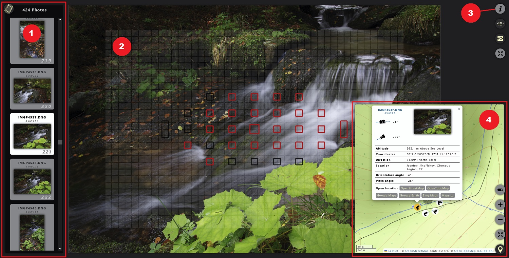
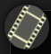
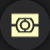
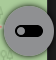
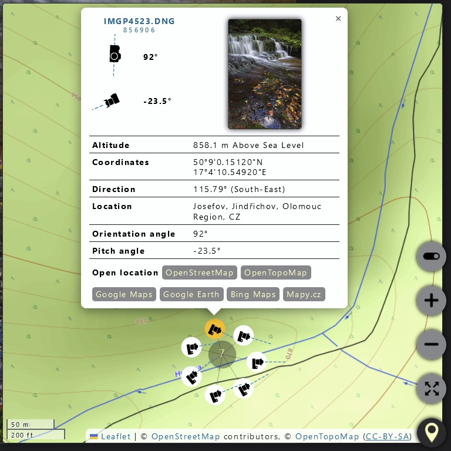

[Back](../README.md)

# Displaying exported data

## 1. Filmstrip Panel

- Can be toggled with  button in the top left page corner.

- Displays the list of exported photos.

- Hovering a particular image in the strip displays tooltip with some basic information about the photo.

- Clicking the photo thumbnail will select it for displaying in the main area.

## 2. Main Photo Area

- Displays the currently selected photo in scaled or actual 1:1 size mode. 

- Switching the mode is done with  button.

- In the actual size mode, image overlays are disabled and the image panning is possible.

- In the scaled size mode, image overlays for `focus areas` and `metering segments` can be displayed. Hovering the particular UI element will display a tooltip with more information.

- `Focus areas` are displayed with  button.

- `Metering segments` are displayed with  button.

- Both focus areas & metering segments overlays can be toggled between normal, hightlighted and no display states.

## 3. Metadata Panel

- Can be toggled with  button in the top right corner.

- Displays exported metadata for the selected photo, optionally filtered by currently selected filter.

- Metadata can be exported to a file.

- Particular cell content in the metadata table can be copied to clipboard by clicking the cell with the mouse.

## 4. Map Panel

- Can be toggled with  button in the bottom right corner.

- Displays selected photo location with location-related data in a map.

- The  button toggles between OpenStreetMap and OpenTopoMap tile variants.

- The  button toggles between small and expanded map view.

- Photos are represented by small camera icons. Those can be directional & properly oriented in the map if needed data is available. 

- If there are multiple photos close to one location, the corresponding icons might be grouped into clusters. Clicking the cluster will expand it into a "spider" and the particular photo icons can then be selected.

- Selecting the photo icon in map will display a tooltip with additional location and orientation data.

    

- Clicking the thumbnail in the tooltip will select the particular photo for displaying detailed info in the main area.

- Clicking a particular data cell in the tooltip table will copy its content into clipboard.

- Clicking one of the links at the bottom of the tooltip will open the location in the corresponding map provider.

---
[Back](../README.md)
